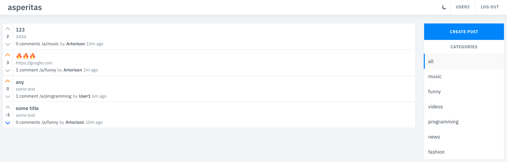
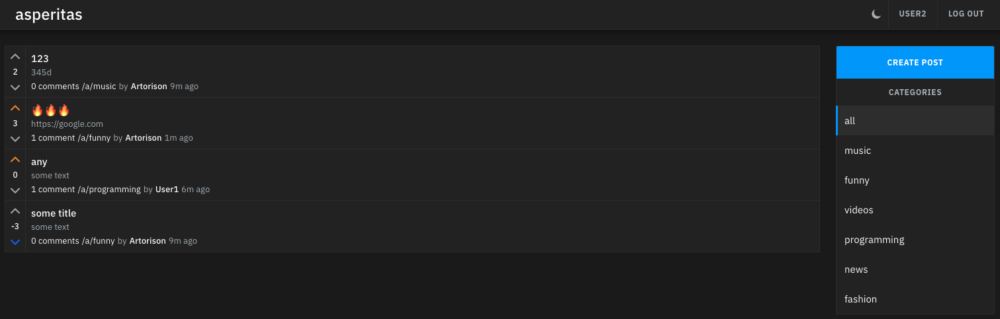
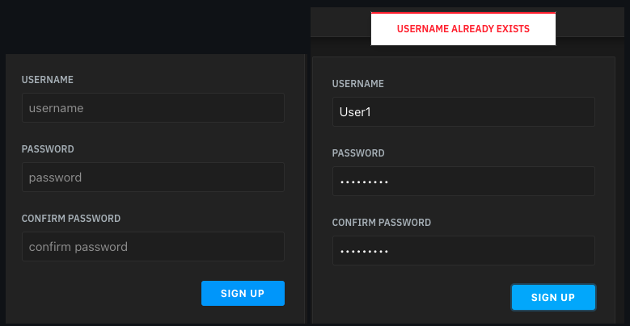
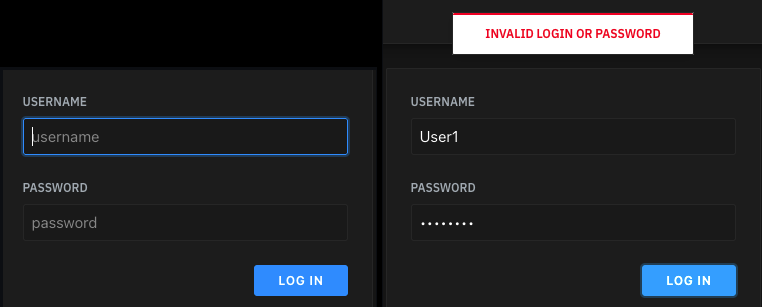
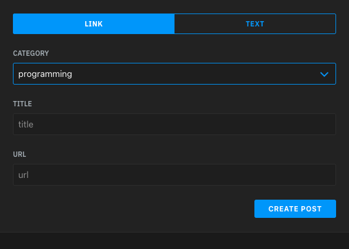
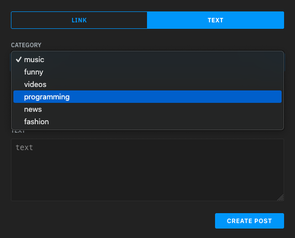
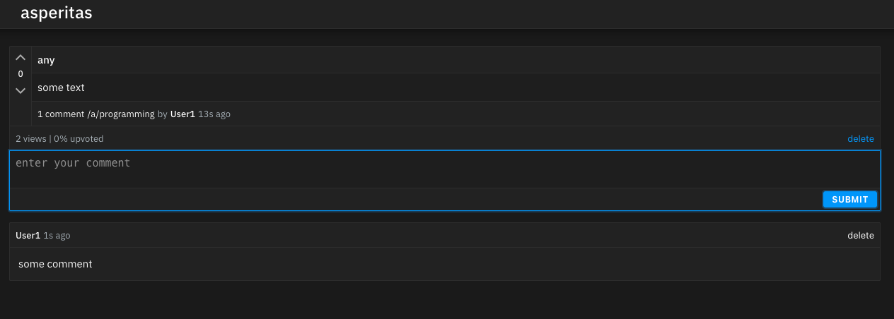

# Social Network
[](https://raw.githack.com/wiki/Artorison/social-network/coverage.html)


Соцсеть с фронтендом: регистрация/логин, публикация постов с категориями, комментарии и голосование. Бэкенд - на `GO`. Авторизация - `JWT`. БД для пользователей и сессий - `MySQL`.Для постов и комментариев - `MongoDB`.

## Стек

* **Go** 1.24.2
* **HTTP**: gorilla/mux
* **Auth**: JWT (HMAC)
* **DB**: MySQL, MongoDB
* Docker, docker compose
* **Тесты**: testify, gomock
* **Линтинг**: golangci-lint
* **Логирование**: slog

## Быстрый старт
### Переменные окружения

Проект читает `.env` через `godotenv`. Пример в корне проекта (`.env.docker` - пример для запуска в `docker`).

### Запуск

```bash
make start
```
или
```bash
docker compose up
```

По умолчанию приложение слушает `http://localhost:3000`.

Остановить:
```bash
make stop
```

## Фичи

* Регистрация и логин, JWT
* Лента постов, категории и страница поста
* Комментарии, up/down‑vote, unvote
* Светлая/тёмная тема
* Логи запросов и восстановление после паник.

---

Светлая/темная тема:



Регистрация и логин с валидацией:





Возможность создавать посты по категориям и типам, удалять посты, ставить лайки/дизлайки постам, оставлять и удалять комментарии:




---

## Тесты

`98.8%` покрытие тестами. Запуск тестов командой: 
```bash
make tests
```
Покрытие:
```bash
make cover
open cover.html
```

В проекте настроен `CI` для прогонки тестов и линтеров.
